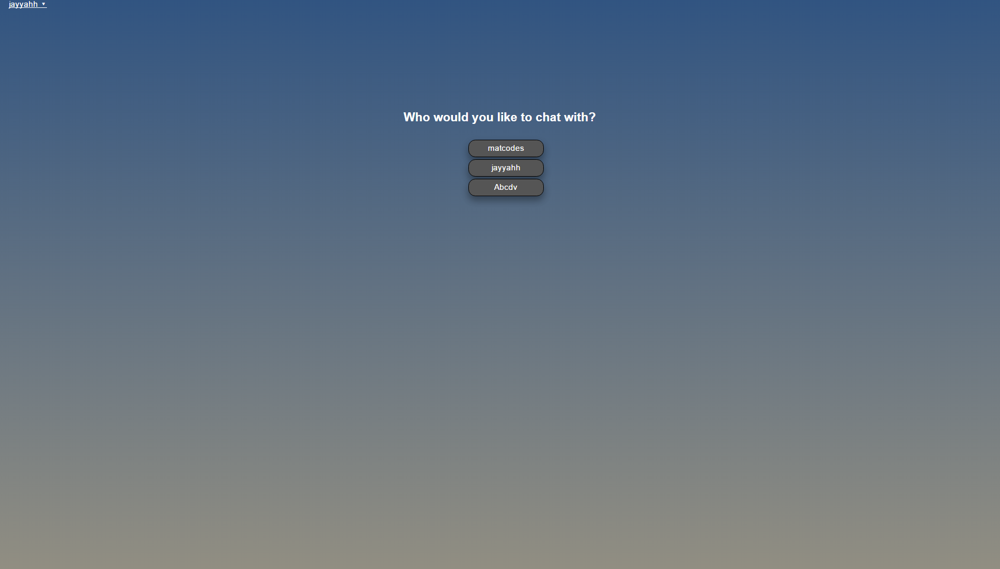
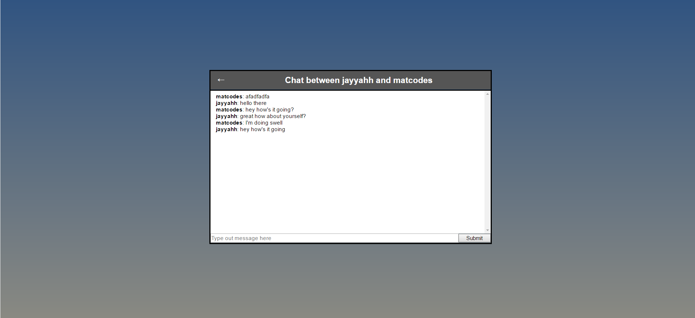

# Meteor Chat

A Simple Instant messaging app 

[Live Demo](https://meteor-chat-react.herokuapp.com/)

## A little bit about Meteor Chat

Meteor chat was developed over the course of a week. Users can create accounts and chat with other registered users in real-time. It was developed using Meteor and React with MongoDB as a backend.

## How to use this app

* Register your account on the top left of the landing page and login.
* Once logged in and authenticated, users can choose to chat with any other registered user in real-time.

## Technical

The frontend of this web application is developed using React and Redux. The backend uses Node.js and Mongo to store information the database. All of the real-time magic is thanks to Meteor.
